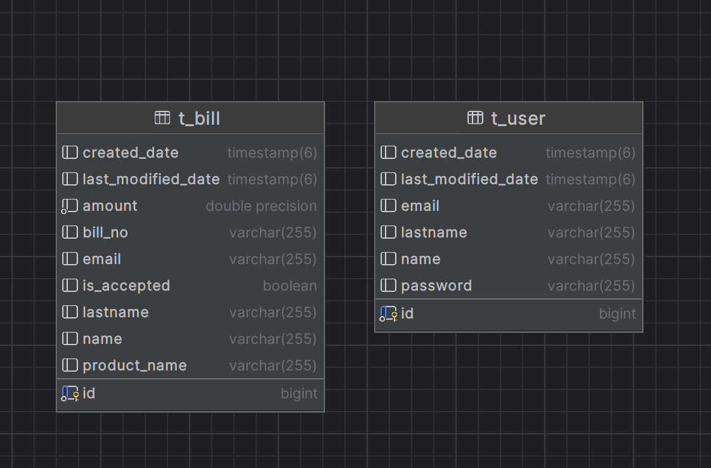

# Emlakjet Case App

## Reference Documentation
The application developed for Emlakjet case. It allows to enter bill information for purchasing personnel which are authenticated.
### Used technologies


* Spring Boot
* Postgresql
* Docker
* Spring Security

### Database Design

| Table            | Description                                             |
|------------------|---------------------------------------------------------|
| t_bill          | storing bill information both of accepted and rejected. |
| t_user           | storing user information and credentials.               |




### Endpoints

| Endpoint                         | Type | Description                                    | Authenticated |
|----------------------------------|------|------------------------------------------------|---------------|
| api/bill                         | POST | It allows to save bill information to database | True          |
| api//bill/get-rejected-bill-list | GET  | It returns to rejected bills because of limit  | True          |
| api/bill/get-accepted-bill-list  | GET  | It returns to accepted bill list               | True          |
| api/auth/login                   | POST | It allows to login                             | False         |


### Requirements
For building and running the application you need:

For Local:
* JDK 17
* Postgres

For Containerization
* Docker

### Running Application

Run the following command to up containers on Docker.

```bash
docker-compose up --build
```

Get postman collection with environment.

https://www.postman.com/gaga-commerce/workspace/aytekin-public-workspace/collection/4224227-21a07cd5-8c90-4496-aba6-763cae2db0e9?action=share&creator=4224227

### Test Endpoints

In order to authenticate the application please take access token from Login endpoint then give to token variable in environment to the given access token in response.

#### Users
The users creating while application bootstrapping which are not exist on the database in AppRunner.java class

| Name                             | Lastname | Email                        | Password     |
|----------------------------------|----------|------------------------------|--------------|
| John                         | Doe     | john@doe.com | Password.123 |
| Jane | Doe      | jane@doe.com  | Password.123         |
| John | Doe      |john2@doe.com | Password.123         |
